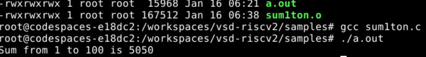

## Lab 1: C Program to Compute Sum from 1 to N

### Objective
To write and execute a C program using the RISC-V GNU compiler toolchain to compute the sum of numbers from 1 to N.

### Program Code (`sum1ton.c`)
```c
#include <stdio.h>

int main() {
    int i, sum = 0, n = 100;
    for (i = 1; i <= n; i++) {
        sum += i;
    }
    printf("Sum from 1 to %d is %d\n", n, sum);
    return 0;
}
 ```


### Commands Used
```bash
gcc sum1ton.c
./a.out
```

### Output
Sum from 1 to 100 is 5050

### Screenshot



### Observation
The C program was successfully compiled and executed using the GNU compiler toolchain. The loop correctly iterates from 1 to N and accumulates the sum of the integers. The output obtained from the program matches the expected mathematical result, confirming the correct functioning of the compiler, execution environment, and program logic.

## Lab 2: RISC-V GCC Compile and Disassemble

### Objective
To compile a C program using the RISC-V GCC toolchain and analyze the generated assembly code using objdump.

---

### Program Code (`sum1ton.c`)
```c
#include <stdio.h>

int main() {
    int i, sum = 0, n = 100;
    for (i = 1; i <= n; i++) {
        sum += i;
    }
    printf("Sum of numbers from 1 to %d is %d\n", n, sum);
    return 0;
}
 ```


### Commands Used
```bash
riscv64-unknown-elf-gcc -O1 -mabi=lp64 -march=rv64i -o sum1ton.o sum1ton.c
riscv64-unknown-elf-gcc -Ofast -mabi=lp64 -march=rv64i -o sum1ton.o sum1ton.c
riscv64-unknown-elf-objdump -d sum1ton.o | less
```

### Output
Sum from 1 to 100 is 5050

### Screenshots

### Observation
The C program was successfully compiled using the RISC-V GCC toolchain. The objdump output shows the corresponding RISC-V assembly instructions, confirming correct compilation and instruction generation.


